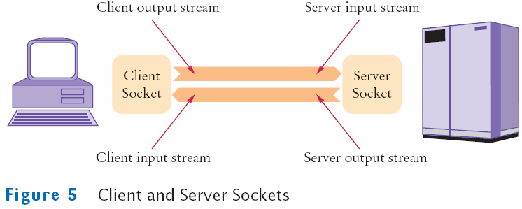
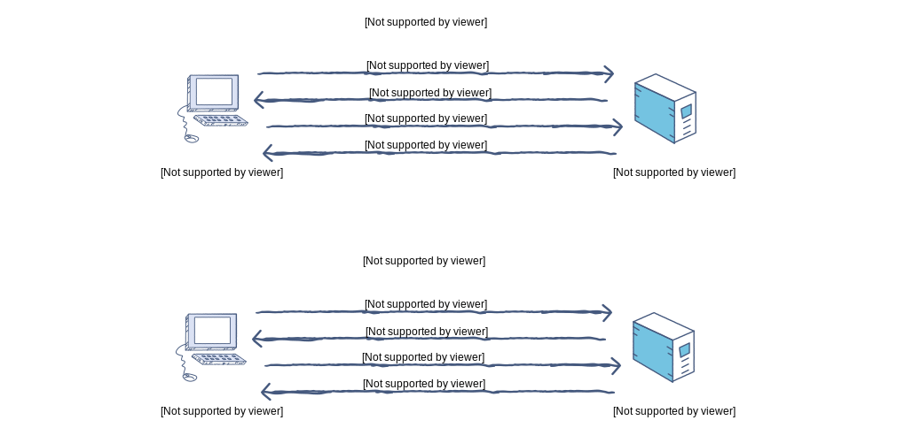
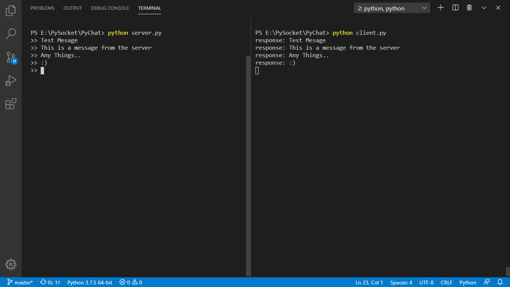
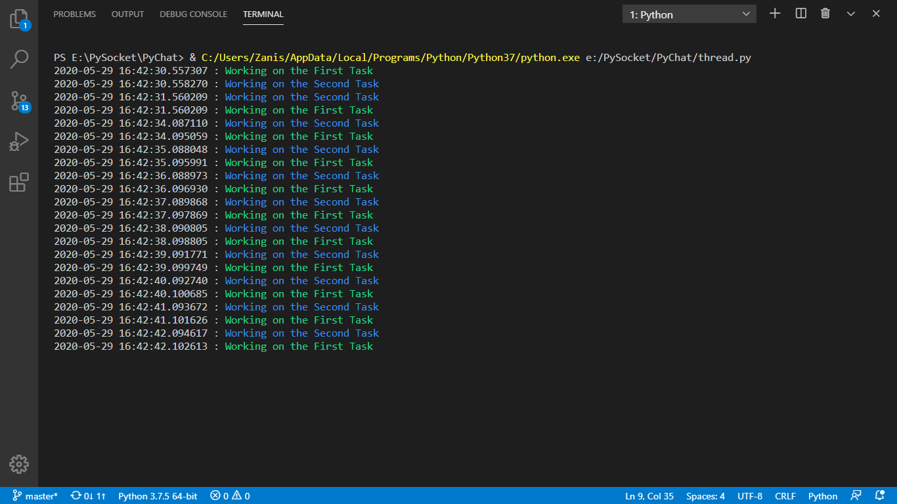
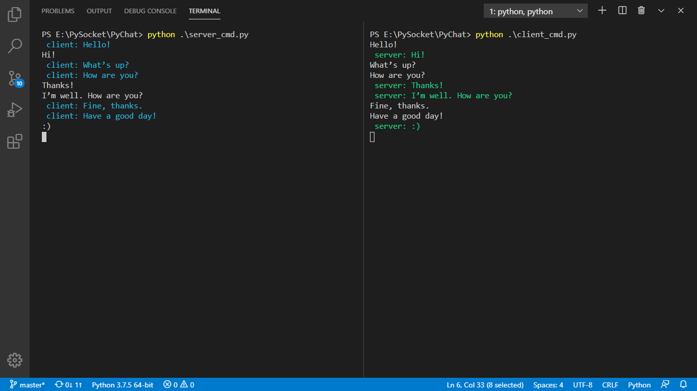

# **PyChat** Massanger

<p>PyChat is a massanger that developed with python and socket library.</p>

Author: **M-Taghizadeh**<br> 
http://m-taghizadeh.ir


# Documentation
- [What is Socket?](#Socket)
- [How TCP work?](#How-TCP-work)
- [How UDP work?](#How-UDP-work)
- [Server implementation in python](#Server-implementation-in-python)
- [Client implementation in python](#Client-implementation-in-python)
- [Threading](#Threading)
- [PyChat cmd implementation with tcp in python](#PyChat-cmd-implementation-with-tcp-in-python)
- [Dependencies](#Dependencies)


# Socket 

Sockets allow communication between clients and server or two different processes on the same or different machines. To be more precise, it's a way to talk to other computers using standard Unix file descriptors. In Unix, every I/O action is done by writing or reading a file descriptor. A file descriptor is just an integer associated with an open file and it can be a network connection, a text file, a terminal, or something else.

To a programmer, a socket looks and behaves much like a low-level file descriptor. This is because commands such as read() and write() work with sockets in the same way they do with files and pipes.

Sockets were first introduced in 2.1BSD and subsequently refined into their current form with 4.2BSD. The sockets feature is now available with most current UNIX system releases.



### Where is Socket Used?

A Unix Socket is used in a client-server application framework. A server is a process that performs some functions on request from a client. Most of the application-level protocols like FTP, SMTP, and POP3 make use of sockets to establish connection between client and server and then for exchanging data.

### Socket Types

There are four types of sockets available to the users. The first two are most commonly used and the last two are rarely used.
Processes are presumed to communicate only between sockets of the same type but there is no restriction that prevents communication between sockets of different types.

- **Stream** Sockets** − Delivery in a networked environment is guaranteed. If you send through the stream socket three items "A, B, C", they will arrive in the same order − "A, B, C". These sockets use TCP (Transmission Control Protocol) for data transmission. If delivery is impossible, the sender receives an error indicator. Data records do not have any boundaries.

- **Datagram Sockets** − Delivery in a networked environment is not guaranteed. They're connectionless because you don't need to have an open connection as in Stream Sockets − you build a packet with the destination information and send it out. They use UDP (User Datagram Protocol).

- **Raw Sockets** − These provide users access to the underlying communication protocols, which support socket abstractions. These sockets are normally datagram oriented, though their exact characteristics are dependent on the interface provided by the protocol. Raw sockets are not intended for the general user; they have been provided mainly for those interested in developing new communication protocols, or for gaining access to some of the more cryptic facilities of an existing protocol.

- **Sequenced** Packet Sockets − They are similar to a stream socket, with the exception that record boundaries are preserved. This interface is provided only as a part of the Network Systems (NS) socket abstraction, and is very important in most serious NS applications. Sequenced-packet sockets allow the user to manipulate the Sequence Packet Protocol (SPP) or Internet Datagram Protocol (IDP) headers on a packet or a group of packets, either by writing a prototype header along with whatever data is to be sent, or by specifying a default header to be used with all outgoing data, and allows the user to receive the headers on incoming packets.


# How TCP work



A TCP connection is established with the help of three-way handshake. It is a process of initiating and acknowledging a connection. Once the connection is established, data transfer begins, and when the transmission process is finished, the connection is terminated by the closing of an established virtual circuit.


# How UDP work

UDP uses a simple transmission method without implied hand-shaking dialogues for ordering, reliability, or data integrity. UDP also assumes that error checking and correction is not important or performed in the application, to avoid the overhead of such processing at the network interface level. It is also compatible with packet broadcasts and multicasting


# Server implementation in python



```python
import socket

# 1-Define Server:
# IPv4: AF_INET, IPv6: AF_INET6
# TCP: SOCK_STREAM, UDP: SOCK_DGRAM
server = socket.socket(socket.AF_INET, socket.SOCK_STREAM)

# 2-Binding:
server_ip = ('localhost', 1234) # ip and port
server.bind(server_ip)

# 3-Listening
server.listen(2) # 2 client cant connect to this server

# 4-Connection
con, addr = server.accept()

# 5-Send Data (Bytes Stream)
# con.send(b"This is a message.")
while True:
    send_data = str.encode(input(">> "))
    con.send("response: " + send_data)
```


# Client implementation in python

```python
import socket

# 1- Define Client 
client = socket.socket(socket.AF_INET, socket.SOCK_STREAM)

# 2- Connect to server
server_ip = ('localhost', 1234) 
client.connect(server_ip)

# 3-Receive Data from server(GET Response) and print it.
# data = client.recv(1024) # receives blocks of size 1024 from the server
while True:
    data = client.recv(1024)
    print(data.decode())
```


# Threading

<p>Threading in python is used to run multiple threads (tasks, function calls) at the same time.</p>



```python
import threading
import time
import datetime as dt 

def task1():
    for i in range(0, 100):
        time_now = dt.datetime.utcnow()
        color = "\033[92m"
        default_color = "\033[00m"
        print(f'{time_now} :{color} Working on the First Task {default_color}')
        time.sleep(1)

def task2():
    for i in range(0, 100):
        time_now = dt.datetime.utcnow()
        color = "\033[94m"
        default_color = "\033[00m"
        print(f'{time_now} :{color} Working on the Second Task {default_color}')
        time.sleep(1)

# step1: define target(function)
thread1 = threading.Thread(target=task1)
thread2 = threading.Thread(target=task2)

# step2: start thread
thread1.start()
thread2.start()
```

# **PyChat** cmd implementation with tcp in python

<p>chat between server and client</p>



### Server side implementation
```python
import socket
import threading

server = socket.socket(socket.AF_INET, socket.SOCK_STREAM)
server.bind(('localhost', 12345))
server.listen(16)
conn, addr = server.accept()

def send_data():
    while True:
        message = str.encode("server: " + input())
        conn.send(message)

def recv_data():
    while True:
        message_recv = conn.recv(1024)
        print("\033[96m {}\033[00m" .format(message_recv.decode()))

threading.Thread(target=send_data).start()
threading.Thread(target=recv_data).start()
```

### Client side implementation
```python
import socket
import threading

client = socket.socket()
client.connect(('localhost', 12345))

def send_data():
    while True:
        message = str.encode("client: " + input())
        client.send(message)

def recv_data():
    while True:
        message_recv = client.recv(1024)
        print("\033[92m {}\033[00m" .format(message_recv.decode()))

threading.Thread(target=send_data).start()
threading.Thread(target=recv_data).start()
```

# Dependencies
- socket
- threading


